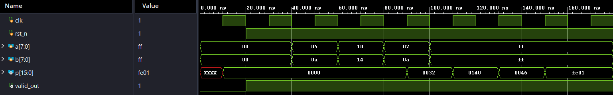

# 🚀 Pipelined 8-Bit Wallace Tree Multiplier

## 📌 Overview

This project implements a **Pipelined 8-Bit Wallace Tree Multiplier** using **Verilog HDL**. The Wallace Tree architecture efficiently reduces partial products, while pipelining improves throughput and overall performance.

---

## ✨ Features

- 8-bit Wallace Tree Multiplier
- Pipelined Architecture
- Carry Look-Ahead Adder (CLA)
- Modular Verilog Design
- Testbench for Functional Verification

---

## 📂 Project Files

| File | Description |
|------|-------------|
| `wallace_tree.v` | Top-level Wallace Tree Multiplier |
| `cla.v` | Carry Look-Ahead Adder (CLA) module |
| `cla16.v` | 16-bit Carry Look-Ahead Adder |
| `wallacetree_tb.v` | Testbench for simulation |

---

## 🛠️ Tools Used

- Verilog HDL
- Xilinx Vivado
- Git
- GitHub

---

## ▶️ Simulation

1. Open the project in Xilinx Vivado.
2. Add the Verilog source files.
3. Set `wallacetree_tb.v` as the simulation top module.
4. Run Behavioral Simulation.

---

## 📊 Simulation Waveform

The following waveform verifies the correct operation of the pipelined 8-bit Wallace Tree Multiplier.

---

## 👨‍💻 Author

**B. Srujan Kausal**
